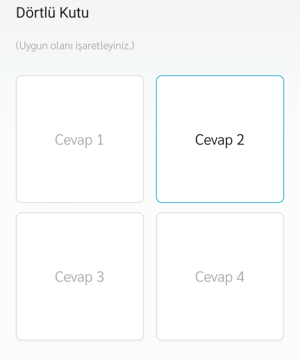
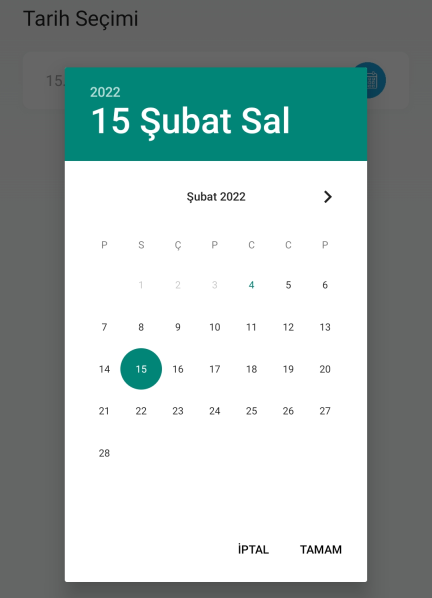

# :fontawesome-solid-poll: Anketler

Detaylı anketler hazırlayarak tüm çalışanlarınızın görüşlerini alabilirsiniz.

Bir [anket tanımladıktan](#anket-tanimla) sonra ilgili anket "Düzenle" butonu ile açılır ve [ankete soru eklenir](#yeni-soru-olustur).

## :fontawesome-solid-poll: Anket Listesi

Oluşturulmuş anketler ve anket raporları burada gösterilir, düzenlenir ya da silinir.

### Görüntüle

İlgili ankete ait sonuçların görüntülenebileceği ekrandır. Rapor, Excel ve PDF formatında indirilebilir ya da yazdırılabilir.

### Düzenle

İlgili anketin düzenlenebileceği ekrandır. Sayfadaki özellikler için bkz: [Anket Tanımla](#anket-tanimla)

### Sil

İlgili anketin silinmesini sağlar. Tıklanması halinde onay penceresi görünür.

## Yeni Anket Oluştur

### Anket Tanımla

Seçili kullanıcıların katılabileceği yeni bir anket oluşturmak için kullanılır.

| Özellik                  | Açıklama                                                     |
| ------------------------ | ------------------------------------------------------------ |
| Bildirim Gönderme Durumu | Açık olması halinde; anket yayınlandığı anda, alıcı listesinde seçilmiş kişilere bildirim gönderilir. |
| Başlık                   | Anket başlığı.                                               |
| Açıklama                 | Anket açıklaması                                             |
| Aktifleştirme Durumu     | Aktif olması durumunda anket görünür, Pasif olması durumunda görünmez. |
| Anket Eforu (Dakika)     | Anketi tamamlamak için tahmini süre                          |
| Anket Başlangıç Tarihi   | Anket, seçilen tarihten sonra görünür olur. Yayınlanma tarihi geldiğinde -aktifleştirildiyse- kullanıcılara bildirim gider. |
| Anket Bitiş Tarihi       | Anket, seçilen tarihten sonra kapanır. Yayınlanma tarihi geldiğinde -aktifleştirildiyse- kullanıcılara bildirim gider. |
| Liste Görseli            | Anket listesinde gösterilecek görseldir.                     |
| Galeri Görseli           | Anket açıldığında gösterilecek görseldir.                    |

!!! note "Not"

    Mobil Yaka uygulaması üzerinden anketi tamamlamış kullanıcı, anketi tamamladığını aynı penceredeki listeden görür.
    
    Kullanıcı ankete katılmadı ise anket bitiş tarihi geldiğinde bu anketi bir daha göremez.
    
    Aktifleştirme durumu "Pasif" seçilirse anket kullanıcılara tamamen görünmez hâle gelir.
    
    Herhangi bir sebeple anketi kaçıran kullanıcılarınız için tekrar aynı anketi oluşturmak yerine, oylama bitiş tarihini uzatabilirsiniz. Bu durumda anketi tamamlamış kullanıcılar için anket tekrar açılmayacaktır.

## Anket Düzenle

### Yeni Soru Oluştur

Bir ankete birden fazla soru eklenebilir.

| Özellik              | Açıklama                                                     |
| -------------------- | ------------------------------------------------------------ |
| Soru Metni           | -                                                            |
| Aktifleştirme Durumu | Aktif olması durumunda soru, anket içerisinde görünür. Pasif olması durumunda görünmez. |
| Soru Tipi Seçiniz    | Aşağıdaki tiplerde soru oluşturulabilir. Soru tiplerinin uygulamada nasıl göründüğünü görmek için bkz: [Soru Tipleri](#soru-tipleri) <ul><li>Çoktan Seçmeli</li><li>Dörtlü Kutu</li><li>Kaydırma Çubuğu</li><li>Çoklu Seçim</li><li>Saat Seçimi</li><li>Tarih Seçimi</li><li>Açık Uçlu / Metin</li><li>Tekil Seçim</li></ul> |
| Soru Sırası          | -                                                            |

##### Soru Tipleri

###### Çoktan Seçmeli

Kullanıcı 4 adet seçenekten yalnızca birini seçer.

###### Dörtlü Kutu

Seçenekler kutu şeklinde görünür, bir adet seçim yapılabilir.

###### Kaydırma Çubuğu

Seçenekler kaydırma çubuğu olarak görünür. İstenen kadar seçenek eklenebilir, bir adet seçim yapılabilir.

###### Çoklu Seçim

İstenen kadar seçenek eklenebilir, birden fazla seçim yapılabilir.

###### Saat Seçimi

###### Tarih Seçimi

###### Açık Uçlu / Metin

Kullanıcıların serbest metin girebileceği alandır.

###### Tekil Seçim

İstenen kadar seçenek eklenebilir, bir adet seçim yapılabilir.

#### Sonuçlar

İlgili anket sorusuna ait sonuçların görüntülenebileceği ekrandır. Rapor, Excel ve PDF formatında indirilebilir ya da yazdırılabilir.

#### Düzenle

İlgili sorunun düzenlenebileceği ekrandır. Sayfadaki özellikler için bkz: [Yeni Soru Oluştur](#yeni-soru-olustur)

!!! warning "Uyarı"

    Anketi tamamlamış en az 1 kullanıcı olması hâlinde;
    
    - Sorularda düzenleme yapılamaz.
    
    - Soru eklenebilir ancak anketi tamamlamış olanlar bu yeni soruları yanıtlayamazlar.

#### Sil

İlgili sorunun silinmesini sağlar. Tıklanması halinde onay penceresi görünür.

## Uygulama İçi Görünümü

??? info "Anket Listesi"

    <iframe width="300" height="533" src="https://xd.adobe.com/embed/a51929be-b754-4dc0-ad0d-97be0156061d-f04a/screen/f1fb2377-9d16-4d07-a0eb-286edd681cbf" frameborder="0" ></iframe>