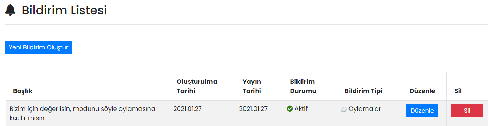

# :material-bell: Bildirimler

Mobil Yaka kullanıcılarına bildirim şeklinde mesajlar gönderilebilir.
## :material-bell: Bildirim Listesi
Oluşturulmuş bildirimler burada gösterilir, düzenlenir ya da silinir.

### Düzenle

İlgili bildirimin düzenlenebileceği ekrandır. Sayfadaki özellikler için bkz: [Bildirim Tanımla](#bildirim-tanimla)

### Sil

İlgili bildirimin silinmesini sağlar. Tıklanması halinde onay penceresi görünür.

## Yeni Bildirim Oluştur

### Bildirim Tanımla

Kullanıcılara yeni bir bildirim göndermek için kullanılır.

| Özellik               | Açıklama                                                     |
| --------------------- | ------------------------------------------------------------ |
| Başlık                | Bildirim metnidir. En fazla 90 karakter olabilir.            |
| Bildirim Tipi Seçiniz | Bildirimin hangi modül ile ilgili olduğudur. Mobil cihazdan bildirime tıklandığında, seçilen modül açılacaktır. |
| Yayınlanma Tarihi     | Bildirim, seçilen tarihte ve saatte yayınlanır.              |

### Alıcılar Listesi

Bildirimin gideceği kullanıcıların ya da kullanıcı gruplarının seçildiği alandır. Kullanıcı ya da gruplar ismine göre aranabilir.

## Uygulama İçi Görünümü

??? info "Bildirimler"

    <iframe width="300" height="533" src="https://xd.adobe.com/embed/a51929be-b754-4dc0-ad0d-97be0156061d-f04a/screen/3ff7f6d1-2aef-4649-b59d-78c99dc59745" frameborder="0" ></iframe>
