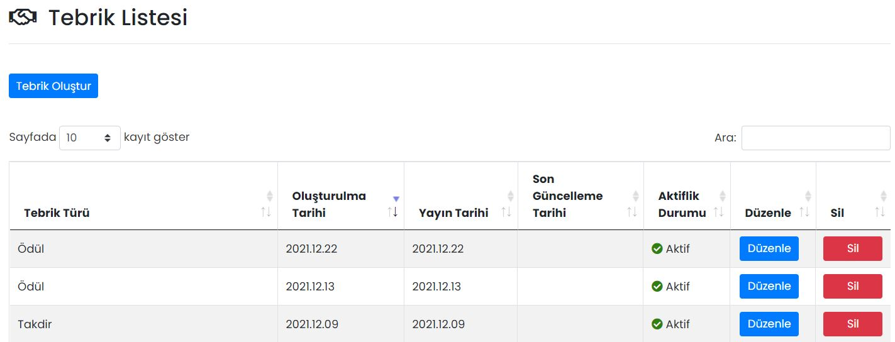

# Tebrikler
Yeni bir tebrik girmek ya da oluşturulmuş tebriklerin görüntülenebileceği ekrandır.

<iframe
    width="640"
    height="480"
    src="https://www.youtube.com/embed/KJa2t9yje2U"
    frameborder="0"
    allow="autoplay; encrypted-media"
    allowfullscreen
>
</iframe>

## Tebrik Oluştur

| Özellik                  | Açıklama                                                     |
| ------------------------ | ------------------------------------------------------------ |
| Bildirim Gönderme Durumu | Açık olması halinde; haber yayınlandığı anda, alıcı listesinde seçilmiş kişilere bildirim gönderilir. |
| Şablon                   | Önceden hazırlanmış şablonlardan seçim yapılır.              |
| Tebrik Türü              | Ne tür tebrik yapılacağıdır. Tebrik türüne göre ikonlar değişir. |

