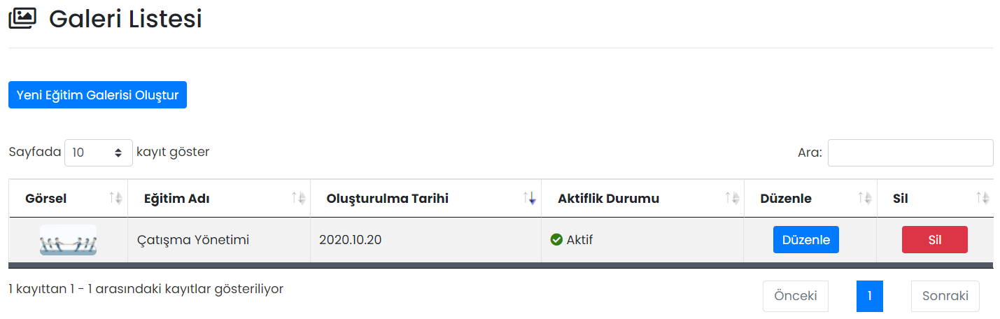

# :fontawesome-regular-images: Eğitim Galerisi

Mobil Yaka uygulamasındaki Eğitim modülüne girildiğinde en üstte görünecek eğitimler buradan seçilir.

## :fontawesome-regular-images: Galeri Listesi

Oluşturulmuş galeri listeleri burada gösterilir, düzenlenir ya da silinir.

### Düzenle

İlgili galeri listesi kaydının düzenlenebileceği ekrandır. Sayfadaki özellikler için bkz: [Galeri Tanımla](#galeri-tanimla)

### Sil

İlgili galeri listesi kaydının silinmesini sağlar. Tıklanması halinde onay penceresi görünür.

## Yeni Eğitim Galerisi Oluştur

### Galeri Tanımla

| Özellik              | Açıklama                                                     |
| -------------------- | ------------------------------------------------------------ |
| Hedef Eğitimi        | Galeride gösterilecek eğitimdir.                             |
| Aktifleştirme Durumu | Aktif olması durumunda galeri listesi kaydı görünür, Pasif olması durumunda görünmez. |
| İçerik Görseli       | Galeride gösterilecek eğitime ait görseldir. Bir görsel seçilmesi zorunludur. |
