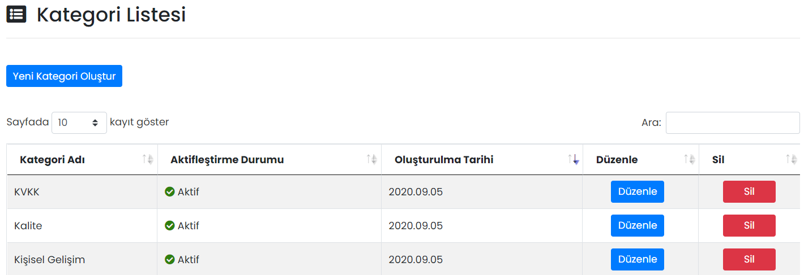

# :fontawesome-solid-list-alt: Kategoriler

## :fontawesome-solid-list-alt: Kategori Listesi

## Yeni Kategori Oluştur

### Kategori Tanımla

Eğitimler için farklı kategoriler tanımlanabilir.

| Özellik              | Açıklama                                                     |
| -------------------- | ------------------------------------------------------------ |
| Kategori Adı         | -                                                            |
| Aktifleştirme Durumu | Aktif olması durumunda kategori, bir eğitime ders eklerken "Eğitim Kategorisi Seçiniz" kısmında görünür, Pasif olması durumunda görünmez. |

!!! note "Not"

    Aktifleştirme Durumu "Pasif" olması durumunda, ilgili kategori sadece yeni ders tanımlanırken Eğitim Kategorisi Seçiniz alanında görünmez. Pasife çekilmiş kategorideki dersler görüntülenmeye devam edecektir.