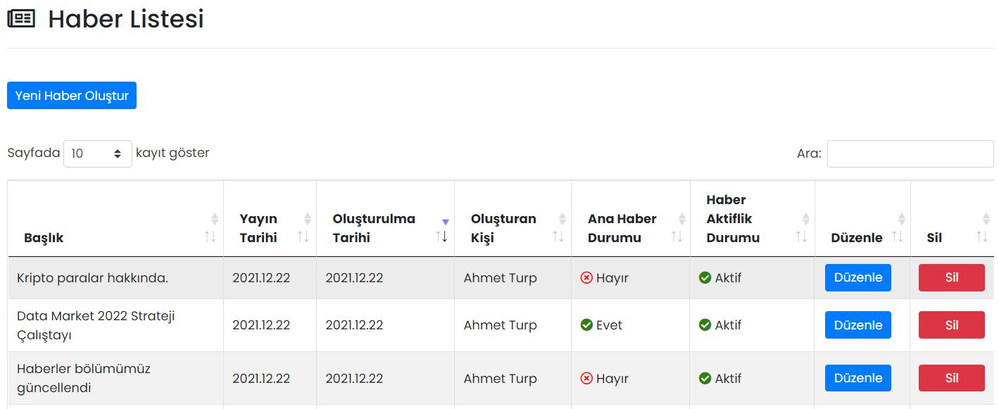

# :fontawesome-regular-newspaper: Haberler
Firmanız ile ilgili haber, duyuru ve gelişmeleri çalışanlarınızla paylaşabilirsiniz.

## :fontawesome-regular-newspaper: Haber Listesi
Oluşturulmuş haberler burada gösterilir, düzenlenir ya da silinir. Haber başlıklarına göre arama yapılabilir.

### Haber Düzenle

İlgili haberin düzenlenebileceği ekrandır. Sayfadaki özellikler için bkz: [Haber Tanımla](#haber-tanimla)

### Haber Sil

İlgili haberin silinmesini sağlar. Tıklanması halinde onay penceresi görünür.

## Yeni Haber Oluştur

### Haber Tanımla

Haberler bölümünde yeni bir haber yayınlamak için kullanılır.

| Özellik                  | Açıklama                                                     |
| ------------------------ | ------------------------------------------------------------ |
| Bildirim Gönderme Durumu | Açık olması halinde; haber yayınlandığı anda, alıcı listesinde seçilmiş kişilere bildirim gönderilir. |
| Başlık                   | Haber başlığı. En fazla 100 karakter olabilir.               |
| Kısa Açıklama            | Başlığın altında görüntülenecek kısa açıklama. En fazla 250 karakter olabilir. |
| Detaylı Açıklama         | Haberin ana metnidir.                                        |
| Aktifleştirme Durumu     | Aktif olması durumunda haber görünür, Pasif olması durumunda görünmez. |
| Ana Haber Durumu         | Aktif olması durumunda haber, haberler sayfasının üstünde bulunan kaydırılabilir haberler kısmında görünür. |
| Detay Video YouTube Link | Haber içeriğine YouTube videosu eklenebilir. Eklenen video, Detay görseli yerine görüntülenecektir. |
| İçerik Görseli           | Haber listesinde gösterilecek görseldir.                     |
| Detay Görseli            | Haber açıldığında gösterilecek görseldir.                    |
| Yayınlanma Tarihi        | Haber, seçilen tarihten sonra görünür olur. Yayınlanma tarihi geldiğinde -aktifleştirildiyse- kullanıcılara bildirim gider. |

### Alıcılar Listesi

Haberi görebilecek kullanıcıların ya da kullanıcı gruplarının seçildiği alandır. Kullanıcı ya da gruplar ismine göre aranabilir. **Kaydet ve Gönder** butonu tıklandığında -aktifleştirildiyse- seçili alıcılara bildirim gider.

## Uygulama İçi Görünümü

??? info "Haber Listesi"

    <iframe width="300" height="533" src="https://xd.adobe.com/embed/a51929be-b754-4dc0-ad0d-97be0156061d-f04a/screen/01a13408-4a01-4f0b-a591-8c8184766c1a/" frameborder="0" ></iframe>
