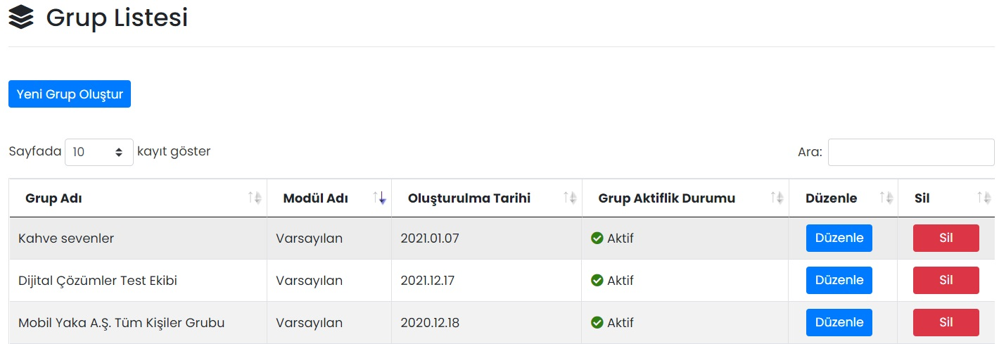

# :material-layers-triple: Kullanıcı Grupları

## :material-layers-triple: Grup Listesi

Kullanıcıların daha kolay yönetimi için kullanıcı grupları oluşturulabilir. Bir içerik yayınlanırken tek tek kullanıcıları seçmek yerine, bağlı oldukları grubu seçerek yönetimlerini kolaylaştırabilirsiniz.

### Düzenle

İlgili grubun düzenlenebileceği ve gruba yeni kullanıcıların eklenebileceği ekrandır. Sayfadaki özellikler için bkz: [Grup Tanımla](#grup-tanimla)

### Sil

İlgili grubun silinmesini sağlar. Tıklanması halinde onay penceresi görünür.

## Yeni Grup Oluştur

### Grup Tanımla

Yeni bir kullanıcı grubu oluşturmak için kullanılır.

| Özellik              | Açıklama                                                     |
| -------------------- | ------------------------------------------------------------ |
| Grup Adı             | -                                                            |
| Modil Adı            | "Ramak Kala" seçildiğinde, Mobil Yaka uygulaması içerisinden gönderilen Ramak Kala bildirimleri, bu gruptaki kişilere e-posta olarak gider. "Varsayılan" ise diğer tüm modüller için kullanılabilir. |
| Aktifleştirme Durumu | Aktif olması durumunda grup görünür, Pasif olması durumunda görünmez. |

### Gruba Kullanıcı Ekle

İlgili gruba yeni kullanıcıların eklendiği ekrandır.

### Seçili Kullanıcıları Gruptan Sil

İlgili gruptaki kullanıcıların gruptan çıkarılmasını sağlar. Tıklanması halinde onay penceresi görünür.