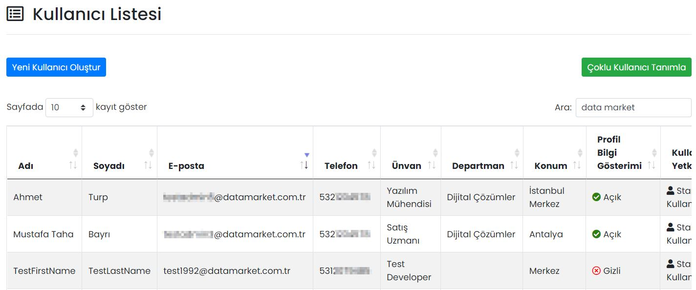

# :fontawesome-solid-users-cog: Kullanıcılar

## :fontawesome-regular-list-alt: Kullanıcı Listesi

Firmanızdaki Mobil Yaka kullanıcıları burada gösterilir, düzenlenir ya da silinir. Arama özelliği ile, kullanıcı listesindeki her hangi bir bilgiye göre arama yapılabilir.

### Düzenle

İlgili kullanıcıya ait bilgilerin düzenlenebileceği ekrandır. Sayfadaki özellikler için bkz: [Kullanıcı Tanımla](#kullanici-tanimla)

### Sil

İlgili kullanıcının silinmesini sağlar. Tıklanması halinde onay penceresi görünür.

## Yeni Kullanıcı Oluştur

###  :octicons-person-add-24: Kullanıcı Tanımla

| Özellik                | Açıklama                                                     |
| ---------------------- | ------------------------------------------------------------ |
| Adı                    | -                                                            |
| Soyadı                 | -                                                            |
| E-posta                | Kullanıcının e-posta adresidir.                              |
| Telefon                | Kullanıcının telefon numarasıdır. Aynı telefon numarası ile birden fazla kullanıcı tanımlanamaz. |
| Ünvan                  | Kullanıcının firma içerisindeki ünvanıdır.                   |
| Şifre                  | Kullanıcının şifresidir.                                     |
| Konum Bilgisi          | Kullanıcının, firmanızın hangi lokasyonuna bağlı olduğu bilgisidir. |
| Departman Bilgisi      | Kullanıcının, firmanızın hangi departmanında olduğu bilgisidir. |
| Profil Resmi           | Kullanıcıya ait profil resmidir.                             |
| Profil Bilgi Gösterimi | "Açık" olması hâlinde kullanıcıya ait bilgiler Rehber uygulamasında görünüyor. "Gizli" olması hâlinde görünmez. |
| Yönetici Yetki Tanımı  | Aktifleştirilmesi halinde kullanıcıya Mobil Yaka Web Portalı erişim yetkisi verilir. |

## Çoklu Kullanıcı Tanımla

Bir Excel dosyası ile, tek seferde sisteme birden çok kullanıcı eklemek için kullanılır.

!!! tip "İpucu"

    Çoklu kullanıcı tanımlarken, "Departman Bilgisi" ve "Konum Bilgisi" alanları, Mobil Yaka'da otomatik olarak oluşturulur. Bir diğer deyişle, çoklu kullanıcıları eklemeden önce "Firma Yönetimi -> Departmanlar" kısmından departmanları elle oluşturmanıza gerek yoktur.
