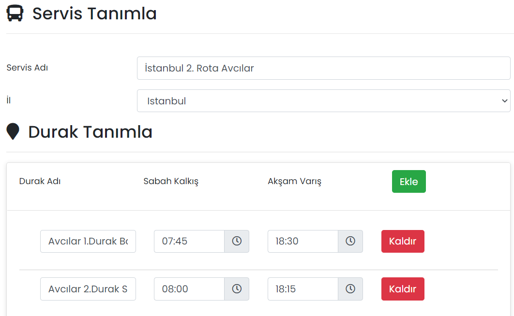

# :fontawesome-solid-bus: Servis Yönetimi

## :fontawesome-solid-bus: Servisler

Firmanızdaki servis bilgileri oluşturulur, düzenlenir ya da silinir.

### Düzenle

İlgili servisin düzenlenebileceği ekrandır. Sayfadaki özellikler için bkz: [Servis Tanımla](#servis-tanimla)

### Sil

İlgili servisin silinmesini sağlar. Tıklanması halinde onay penceresi görünür.

## Yeni Servis Oluştur

### Servis Tanımla

Yeni bir servis tanımlayı sağlar.

{: style="height:439px;width:712px"}

| Özellik    | Açıklama                    |
| ---------- | --------------------------- |
| Servis Adı | -                           |
| İl         | Servisin hizmet verdiği il. |

### Durak Tanımla

Servisin geçeceği duraklar ve sabah/akşam saatleri eklenir.

## Uygulama İçi Görünümü

??? info "Bildirimler"

    <iframe width="300" height="533" src="https://xd.adobe.com/embed/a51929be-b754-4dc0-ad0d-97be0156061d-f04a/screen/3ff7f6d1-2aef-4649-b59d-78c99dc59745" frameborder="0" ></iframe>