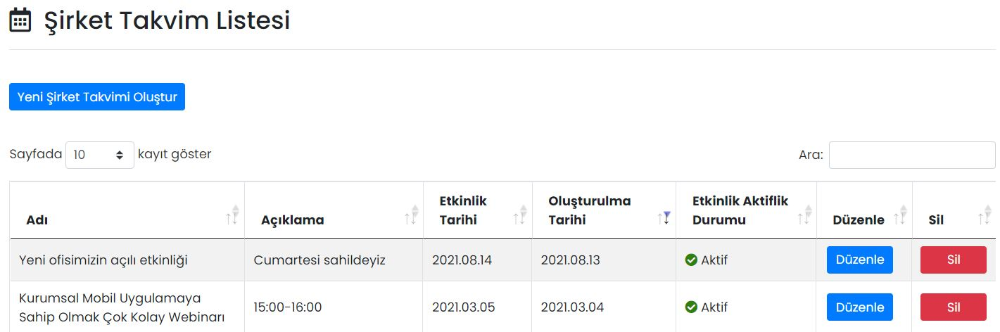

# :material-calendar-month: Şirket Takvimi

Şirket Takvimi'nde firmanıza ait etkinlikler, resmî tatiller ve geziler gibi önemli tarihler çalışanlarla paylaşılabilir.

## :material-calendar-month: Şirket Takvim Listesi

Oluşturulmuş etkinlikler burada gösterilir, düzenlenir ya da silinir. Etkinlik başlığına ve açıklamasına göre arama yapılabilir.

### Düzenle

İlgili etkinliğin düzenlenebileceği ekrandır. Sayfadaki özellikler için bkz: [Şirket Takvimi Tanımla](#sirket-takvimi-tanimla)

### Sil

İlgili etkinliğin silinmesini sağlar. Tıklanması halinde onay penceresi görünür.

## Yeni Şirket Takvimi Oluştur

### Şirket Takvimi Tanımla

Şirket Takvimi'ne yeni bir etkinlik girmek için kullanılır.

| Özellik                  | Açıklama                                                     |
| ------------------------ | ------------------------------------------------------------ |
| Bildirim Gönderme Durumu | Açık olması halinde; takvim yayınlandığı anda, alıcı listesinde seçilmiş kişilere bildirim gönderilir. |
| Etkinlik Adı             | -                                                            |
| Açıklama                 | -                                                            |
| Aktifleştirme Durumu     | Aktif olması durumunda takvim görünür, Pasif olması durumunda görünmez. |
| Etkinlik Kategorisi      | Takvimin hangi kategoriye ait olduğunu belirtir. Kategoriler farklı renklere sahip olabilir. |
| Etkinlik Tarihi          | Etkinliğin hangi gün ve saatte olacağını belirtir.           |

## Uygulama İçi Görünümü

??? info "Şirket Takvimi"

    <iframe width="300" height="533" src="https://xd.adobe.com/embed/a51929be-b754-4dc0-ad0d-97be0156061d-f04a/screen/2af16928-7785-48d7-a127-6c988fed3403" frameborder="0" ></iframe>
