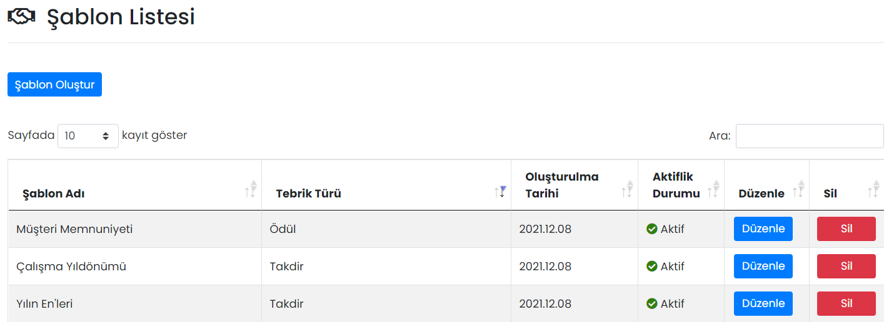

# :fontawesome-regular-handshake: Şablonlar

Şablonlar, sık kullanılacak tebriklerin bir kere tanımlanıp, yeni tebrik oluştururken aynı verilerin tekrar kullanılmasını sağlar.

### :fontawesome-regular-handshake: Şablon Listesi

Oluşturulmuş şablonlar burada gösterilir, düzenlenir ya da silinir.

### Şablon Düzenle

İlgili haberin düzenlenebileceği ekrandır. Sayfadaki özellikler için bkz: [Şablon Tanımla](#sablon-tanimla)

### Şablon Sil

İlgili haberin silinmesini sağlar. Tıklanması halinde onay penceresi görünür.

## Şablon Oluştur

### Şablon Tanımla

Yeni bir şablon oluşturmak için kullanılır.

| Özellik              | Açıklama                                                     |
| -------------------- | ------------------------------------------------------------ |
| Aktifleştirme Durumu | Aktif olması durumunda şablon listesinde bu şablon görünür, Pasif olması durumunda görünmez. |
| Şablon Adı           | Şablon listesinde görünecek addır.                           |
| Tebrik Türü          | Takdir, teşekkür, ödül gibi değerler alabilir.               |
| Açıklama             | Tebriğin açıklamasıdır.                                      |
| Rozet                | Tebrik listesinde gösterilecek görseldir.                    |
| Detay Görseli        | Tebrik açıldığında gösterilecek görseldir.                   |

!!! tip "İpucu"

    Detay Görseli için tavsiye edilen imaj çözünürlüğü 800x600'dür.